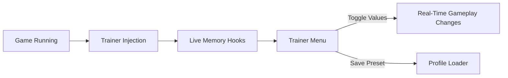

## 🌘 When the Dungeon Listens Back

In the echoing halls of **Dreadmyst**, every step matters. Fear is measured in torchlight, and progress is carved from patience. The **Dreadmyst Trainer** is a PC-based control software crafted to give you authorship over that experience—quietly, precisely, and entirely on your terms.

This is not a loud instrument of domination. It is a tuning fork. A way to bend pacing, test builds, and soften sharp edges without silencing the game’s soul.

---

## 🧭 Overview: A Trainer Built for Balance

The trainer operates as a **real-time modifier**, allowing you to alter values while the game is running. No permanent changes. No file edits. Just clean, reversible control over systems that shape survival, exploration, and combat rhythm.

Whether you’re experimenting with character paths or revisiting brutal zones, the trainer adapts to your intent.

---

## 🔑 Trainer Features (Live Toggles)

### 🩸 Survival & Resources

* **God Mode (Optional)** — Explore without punishment when learning layouts.
* **Unlimited Health / Stamina** — Ideal for testing encounters and mechanics.
* **Freeze Consumables** — Practice runs without inventory pressure.

### ⚔️ Combat Flow Adjustments

* **Damage Multiplier** — Scale output up or down for fine balance control.
* **One-Hit Toggle** — For fast clears or encounter debugging.
* **Enemy Damage Control** — Reduce incoming damage without disabling danger.

### 🧭 Exploration Enhancements

* **Movement Speed Control** — Smooth backtracking or faster exploration.
* **No Cooldowns** — Experiment freely with skills and abilities.
* **Stealth Stability** — Prevent accidental detection while learning routes.

> [!NOTE]
> Every option is **independent and hotkey-driven**. Enable only what serves your current goal.


---

## ⚡ Setup — Lighting the First Torch

1. Launch **Dreadmyst** and load into your save.
2. Start the **Trainer** as administrator.
3. Attach using the automatic process list.
4. Open the trainer menu (`F1` by default).
5. Toggle features gradually and save presets if needed.

```text
Suggested starter preset:
- Infinite Stamina
- Reduced Enemy Damage (0.5x)
- Normal Player Damage
```

> [!IMPORTANT]
> Use gradual adjustments. The dungeon feels best when tension still breathes.

---

## 🔄 Internal Flow (How It Works)



No restarts required. Changes apply instantly and can be undone just as easily.

---

## ❓ FAQ — Voices from the Depths

**Is the Dreadmyst Trainer safe to use?**
Yes, for offline single-player use. It does not interact with online systems.

**Will this corrupt my save?**
The trainer avoids save-file modification. Closing it restores default behavior.

**Can I combine features?**
Absolutely. Most players create multiple presets for testing, exploration, and speed runs.

**Does it work after updates?**
Minor patches are usually supported. Core updates may require a trainer refresh.

**Is this beginner-friendly?**
Very. Clean UI, labeled toggles, and no scripting required.

---

## 🛑 A Quiet Warning

> [!WARNING]
> Overusing invulnerability can dull the atmosphere. Use the trainer as a tool, not a crutch.

Best practice is intention: turn features on with purpose, and off when the lesson is learned.

---

## 🌑 Final Thoughts — Power with Restraint

The **Dreadmyst Trainer** is for players who love the world but wish to converse with it differently. It grants time to learn, space to experiment, and freedom to wander without erasing the weight of darkness.

Used thoughtfully, it becomes less a cheat—and more a companion.

Walk slowly. Adjust wisely. The dungeon remembers.
